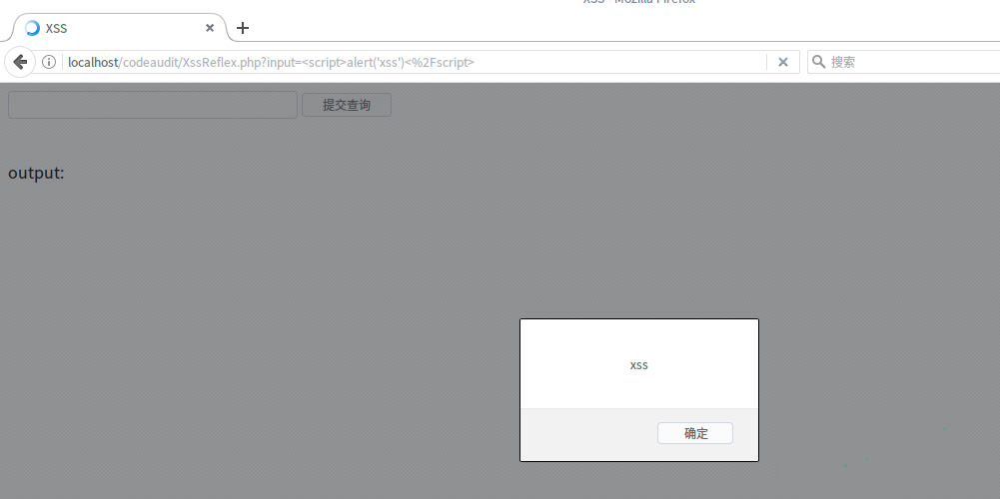
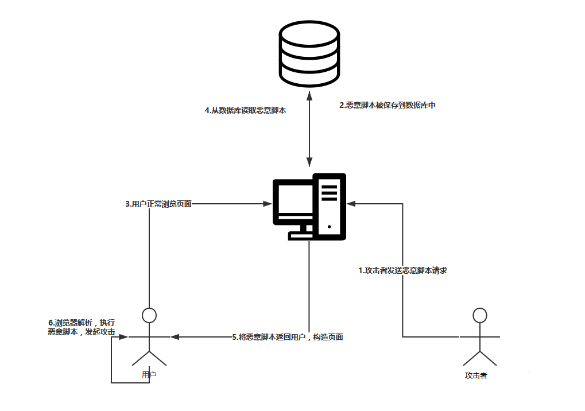
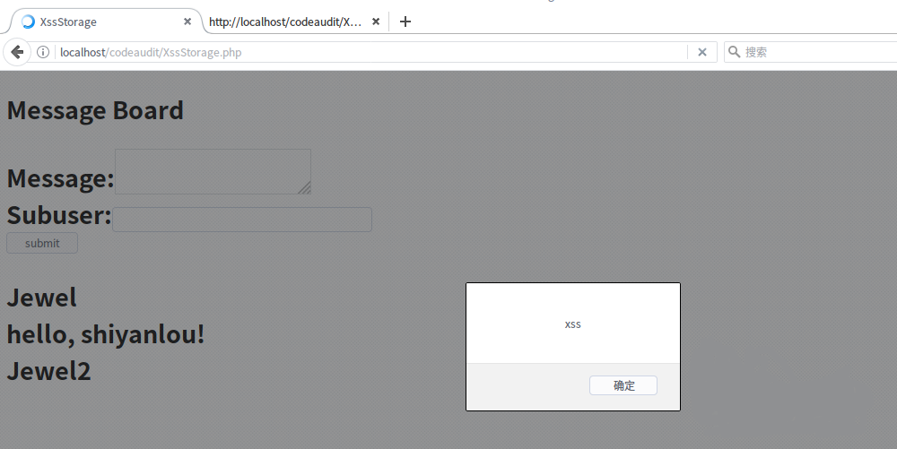

# 跨站脚本攻击(XSS)基础

[参考自该博客]: https://www.jianshu.com/p/4fcb4b411a66


## 一.什么是XSS跨站脚本攻击

```java
	跨站脚本攻击是指恶意攻击者往Web页面里插入恶意Script代码，当用户浏览该页之时，嵌入其中Web里面的Script代码会被执行，从而达到恶意攻击用户的目的。    
```


## 二.跨站脚本攻击分类

```java
	反射型XSS：<非持久化> 攻击者事先制作好攻击链接, 需要欺骗用户自己去点击链接才能触发XSS代码（服务器中没有这样的页面和内容），一般容易出现在搜索页面。

	存储型XSS：<持久化> 代码是存储在服务器中的，如在个人信息或发表文章等地方，加入代码，如果没有过滤或过滤不严，那么这些代码将储存到服务器中，每当有用户访问该页面的时候都会触发代码执行，这种XSS非常危险，容易造成蠕虫，大量盗窃cookie（虽然还有种DOM型XSS，但是也还是包括在存储型XSS内）。

	DOM型XSS：基于文档对象模型Document Objeet Model，DOM)的一种漏洞。DOM是一个与平台、编程语言无关的接口，它允许程序或脚本动态地访问和更新文档内容、结构和样式，处理后的结果能够成为显示页面的一部分。DOM中有很多对象，其中一些是用户可以操纵的，如uRI ，location，refelTer等。客户端的脚本程序可以通过DOM动态地检查和修改页面内容，它不依赖于提交数据到服务器端，而从客户端获得DOM中的数据在本地执行，如果DOM中的数据没有经过严格确认，就会产生DOM XSS漏洞。
```


## 三.XSS漏洞原理

### 1.反射型XSS

```java
	在黑盒测试中，这种类型比较容易通过漏洞扫描器直接发现，我们只需要按照扫描结果进行相应的验证就可以了。
	相对的在白盒审计中， 我们首先要寻找带参数的输出函数，接下来通过输出内容回溯到输入参数，观察是否过滤即可。
```

```java
例如以下一段php代码:
```

```php+HTML
<html>
<head> 
    <meta http-equiv="Content-Type" content="text/html; charset=utf-8" /> 
    <title>XSS</title> 
</head> 
<body> 
    <form action="" method="get"> 
        <input type="text" name="input">     
        <input type="submit"> 
    </form> 
    <br> 
    <?php 
    $XssReflex = $_GET['input'];
    echo 'output:<br>'.$XssReflex;
    ?> 
</body> 
</html> 
```

```java
这是一个很简单、也很常见的页面：
	变量 $XssReflex 获取 get 方式传递的变量名为 input 的变量值（值为一个字符串），然后直接通过echo()函数输出，注意这中间并未对用户输入进行任何过滤。
```

```java
如果我们输出一些javascript代码
    <script>alert('xss')</script>
```



```java
	这个弹窗并没有什么实际的意义，但通过它我们知道输入javascript代码是可以被执行的，当我们输入一些其他函数，比如document.cookie就可以成功盗取用户的cookie信息，或者读取用户浏览器信息等，为我们进一步深入攻击做铺垫。
```

### 2.存储型XSS

```java
	反射型XSS感觉，和我们后端没有关系，但是这种方式就和我们有关了。
    和反射性XSS的即时响应相比，存储型XSS则需要先把利用代码保存在比如数据库或文件中，当web程序读取利用代码时再输出在页面上执行利用代码。但存储型XSS不用考虑绕过浏览器的过滤问题，屏蔽性也要好很多。
```

```java
存储型XSS攻击流程：
```



```java
	存储型XSS的白盒审计同样要寻找未过滤的输入点和未过滤的输出函数。
```

```java
例如下面一段php代码：
```

```php+HTML
    <span style="font-size:18px;"><meta http-equiv="Content-Type" content="text/html;charset=utf-8"/>  
    <html>  
    <head>  
    <title>XssStorage</title>  
    </head>  
    <body>  
    <h2>Message Board<h2>  
    <br>
    <form action="XssStorage.php" method="post">  
    Message:<textarea id='Mid' name="desc"></textarea>  
    <br>  
    <br>  
    Subuser:<input type="text" name="user"/><br> 
    <br>
    <input type="submit" value="submit" onclick='loction="XssStorage.php"'/>  
    </form>  
        
        
    <?php  
    if(isset($_POST['user'])&&isset($_POST['desc'])){  
    $log=fopen("sql.txt","a");  
    fwrite($log,$_POST['user']."\r\n");  
    fwrite($log,$_POST['desc']."\r\n");  
    fclose($log);  
    }  
      
    if(file_exists("sql.txt"))  
    {  
    $read= fopen("sql.txt",'r');  
    while(!feof($read))  
    {  
        echo fgets($read)."</br>";  
    }  
    fclose($read);  
    }  
    ?>  
        
        
    </body>  
    </html></span> 
```

```java
	这个页面采用POST提交数据，生成、读取文本模拟数据库，提交数据之后页面会将数据写入sql.txt，再打开页面时会读取sql.txt中内容并显示在网页上，实现了存储型xss攻击模拟。
```

```java
	当我们在Message中输入<script>alert('xss')</script>时，页面成功弹窗,
	并且我们重启浏览器之后再加载该页面，页面依然会弹窗,这是因为恶意代码已经写入数据库中，每当有人访问该页面时，恶意代码就会被加载执行！
    这就是所谓的存储型XSS漏洞，一次提交之后，每当有用户访问这个页面都会受到XSS攻击，危害巨大。
```



### 3.DOM XSS

```java
	这种XSS用的相对较少，并且由于其特殊性，常见的漏扫工具都无法检测出来，这里先不做讲解。
```

