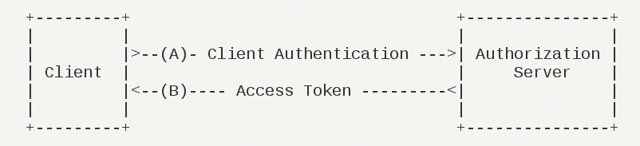

# JWT与OAuth2

## 一.JWT与OAuth2的比较

```java
	要比较JWT和OAuth2？首先要明白一点就是，这两个根本没有可比性，是两个完全不同的东西。
```

```java
	JWT是一种认证协议
        基本思路就是用户提供用户名和密码给认证服务器，服务器验证用户提交信息信息的合法性；如果验证成功，会产生并返回一个Token（令牌），用户可以使用这个token访问服务器上受保护的资源。
```

```java
	OAuth2是一种授权框架
        OAuth2是一种授权框架，提供了一套详细的授权机制（指导）。用户或应用可以通过公开的或私有的设置，授权第三方应用访问特定资源。
```

```java
	既然JWT和OAuth2没有可比性，为什么还要把这两个放在一起说呢？
    实际中确实会有很多人拿JWT和OAuth2作比较。
    很多情况下，在讨论OAuth2的实现时，会把JSON Web Token作为一种认证机制使用。这也是为什么他们会经常一起出现。
```

## 二.JSON Web Token (JWT)

```java
token==个人证件  
jwt==个人身份证
```


```java
JWT包含三部分数据：
	header.claims.signature
    为了在url中使用，所有部分都 base64进行编码处理。
```

```java
Header：头部，通常头部有两部分信息
    产生签名所使用的算法以及声明类型
    {
      "alg" : "AES256",
      "typ" : "JWT"
    }
```

```java
Claims：载荷，就是有效数据，一般包含下面信息
    用户身份信息:注意，这里因为采用base64编码，可解码，因此不要存放敏感信息
    注册声明:如token的签发时间，过期时间，签发人等
    
一个简单的Claims的例子
    {
      "sub": "1234567890",
      "name": "John Doe",
      "admin": true
	}    
```

```java
Signature：签名，是整个数据的认证信息。
    一般根据前两步的数据，再加上服务的的密钥（secret）（不要泄漏，最好周期性更换），通过加密算法生成。用于验证整个数据完整和可靠性。
    签名的目的是为了保证上边两部分信息不被篡改。如果尝试使用Bas64对解码后的token进行修改，签名信息就会失效。
```

## 三.JWT交互流程


```java
1、用户登录
2、服务的认证，通过后根据密钥加密生成token
3、将生成的token返回给浏览器
4、用户每次请求携带token
5、服务端利用密钥解密JWT签名，判断签名有效后，从Claims中获取用户信息
6、处理请求，返回响应结果
```

## 四.加密算法

```java
	加密技术是对信息进行编码和解码的技术。
    编码是把原来可读信息（又称明文）译成代码形式（又称密文），其逆过程就是解码（解密）。
    加密技术的要点是加密算法，加密算法可以分为三类：
    1.对称加密，如AES
  		基本原理：将明文分成N个组，然后使用密钥对各个组进行加密，形成各自的密文，最后把所有的分组密文进行合并，形成最终的密文。
  		优势：算法公开、计算量小、加密速度快、加密效率高
  		缺陷：双方都使用同样密钥，安全性得不到保证 
 	2.非对称加密，如RSA
  		基本原理：同时生成两把密钥：私钥和公钥，私钥隐秘保存，公钥可以下发给信任客户端
    			私钥加密，持有私钥或公钥才可以解密
    			公钥加密，持有私钥才可解密
  		优点：安全，难以破解
  		缺点：算法比较耗时
	3.不可逆加密，如MD5，SHA 
  		基本原理：加密过程中不需要使用密钥，输入明文后由系统直接经过加密算法处理成密文，这种加密后的数据是无法被解密的，无法根据密文推算出明文。可能被暴力解密，穷举法,baidu MD5，第一个就是在线解密破解。
```

```java
	ps：在上文提到的Base64，并不是一种加密算法，而是一种编码方式，和ASCII编码类似。
```

## 五.OAuth2

```java
	OAuth是一种用来规范令牌（Token）发放的授权机制，主要包含了四种授权模式：授权码模式、简化模式、密码模式和客户端模式。
```

### 1.前言

```java
	在了解这四种授权模式之前，我们需要先学习一些和OAuth相关的名词。举个社交登录的例子吧，比如在浏览器上使用QQ账号登录虎牙直播，这个过程可以提取出以下几个名词：

    Third-party application : 第三方应用程序，比如这里的虎牙直播；

    HTTP service : HTTP服务提供商，比如这里的QQ（腾讯）;

    Resource Owner : 资源所有者，就是QQ的所有人，你；

    User Agent : 用户代理，这里指浏览器；

    Authorization server : 认证服务器，这里指QQ提供的第三方登录服务；

    Resource server : 资源服务器，这里指虎牙直播提供的服务，比如高清直播，弹幕发送等（需要认证后才能使用）。

	认证服务器和资源服务器可以在同一台服务器上。
    比如前后端分离的服务后台，它既供认证服务（认证服务器，提供令牌），也提供资源服务，客户端通过令牌来从后台获取服务（资源服务器）；它们也可以不在同一台服务器上，比如上面第三方登录的例子。
```

### 2.授权码模式

```java
	授权码模式是最能体现OAuth2协议，最严格，流程最完整的授权模式，流程如下所示：
```


```java
A. 客户端将用户导向认证服务器；

B. 用户决定是否给客户端授权；

C. 同意授权后，认证服务器将用户导向客户端提供的URL，并附上授权码；

D. 客户端通过重定向URL和授权码到认证服务器换取令牌；

E. 校验无误后发放令牌。

其中A步骤，客户端申请认证的URI，包含以下参数：

    1.response_type：表示授权类型，必选项，此处的值固定为”code”，标识授权码模式

    2.client_id：表示客户端的ID，必选项

    3.redirect_uri：表示重定向URI，可选项

    4.scope：表示申请的权限范围，可选项

    5.state：表示客户端的当前状态，可以指定任意值，认证服务器会原封不动地返回这个值。

D步骤中，客户端向认证服务器申请令牌的HTTP请求，包含以下参数：

    1.grant_type：表示使用的授权模式，必选项，此处的值固定为”authorization_code”。

    2.code：表示上一步获得的授权码，必选项。

    3.redirect_uri：表示重定向URI，必选项，且必须与A步骤中的该参数值保持一致。

    4.client_id：表示客户端ID，必选项。
```

### 3.密码模式

```java
	在密码模式中，用户像客户端提供用户名和密码，客户端通过用户名和密码到认证服务器获取令牌。流程如下所示：
```


```java
A. 用户向客户端提供用户名和密码；

B. 客户端向认证服务器换取令牌；

C. 发放令牌。

B步骤中，客户端发出的HTTP请求，包含以下参数：

    1.grant_type：表示授权类型，此处的值固定为”password”，必选项。

    2.username：表示用户名，必选项。

    3.password：表示用户的密码，必选项。

    4.scope：表示权限范围，可选项。
```

### 4.简化模式

```java
	简化模式（implicit grant type）不通过第三方应用程序的服务器，直接在浏览器中向认证服务器申请令牌，跳过了"授权码"这个步骤，因此得名。所有步骤在浏览器中完成，令牌对访问者是可见的，且客户端不需要认证。
```


```java


    （A）客户端将用户导向认证服务器。

    （B）用户决定是否给于客户端授权。

    （C）假设用户给予授权，认证服务器将用户导向客户端指定的"重定向URI"，并在URI的Hash部分包含了访问令牌。

    （D）浏览器向资源服务器发出请求，其中不包括上一步收到的Hash值。

    （E）资源服务器返回一个网页，其中包含的代码可以获取Hash值中的令牌。

    （F）浏览器执行上一步获得的脚本，提取出令牌。

    （G）浏览器将令牌发给客户端。

```

```java
A步骤中，客户端发出的HTTP请求，包含以下参数：
    response_type：表示授权类型，此处的值固定为"token"，必选项。
    client_id：表示客户端的ID，必选项。
    redirect_uri：表示重定向的URI，可选项。
    scope：表示权限范围，可选项。
    state：表示客户端的当前状态，可以指定任意值，认证服务器会原封不动地返回这个值。
```

```java
C步骤中，认证服务器回应客户端的URI，包含以下参数：
    access_token：表示访问令牌，必选项。
    token_type：表示令牌类型，该值大小写不敏感，必选项。
    expires_in：表示过期时间，单位为秒。如果省略该参数，必须其他方式设置过期时间。
    scope：表示权限范围，如果与客户端申请的范围一致，此项可省略。
    state：如果客户端的请求中包含这个参数，认证服务器的回应也必须一模一样包含这个参数。
```

### 5.客户端模式

```java
	客户端模式（Client Credentials Grant）指客户端以自己的名义，而不是以用户的名义，向"服务提供商"进行认证。严格地说，客户端模式并不属于OAuth框架所要解决的问题。在这种模式中，用户直接向客户端注册，客户端以自己的名义要求"服务提供商"提供服务，其实不存在授权问题。
```



```java


    （A）客户端向认证服务器进行身份认证，并要求一个访问令牌。

    （B）认证服务器确认无误后，向客户端提供访问令牌。

```

```java
A步骤中，客户端发出的HTTP请求，包含以下参数：
    granttype：表示授权类型，此处的值固定为"clientcredentials"，必选项。
    scope：表示权限范围，可选项。
```

```java
B步骤中，认证服务器向客户端发送访问令牌，下面是一个例子。
     {
       "access_token":"2YotnFZFEjr1zCsicMWpAA",
       "token_type":"example",
       "expires_in":3600,
       "example_parameter":"example_value"
     }
```

### 6.更新令牌

```java
如果用户访问的时候，客户端的"访问令牌"已经过期，则需要使用"更新令牌"申请一个新的访问令牌。

客户端发出更新令牌的HTTP请求，包含以下参数：

    granttype：表示使用的授权模式，此处的值固定为"refreshtoken"，必选项。
    refresh_token：表示早前收到的更新令牌，必选项。
    scope：表示申请的授权范围，不可以超出上一次申请的范围，如果省略该参数，则表示与上一次一致。
```

## 参考链接

[Spring Security OAuth2入门]: https://mrbird.cc/Spring-Security-OAuth2-Guide.html
[理解OAuth 2.0]: http://www.ruanyifeng.com/blog/2014/05/oauth_2_0.html
[OAuth2和JWT - 如何设计安全的API？]: https://www.jianshu.com/p/1f2d6e5126cb
[Base64原理]: https://baijiahao.baidu.com/s?id=1644892102150918183&amp;wfr=spider&amp;for=pc

