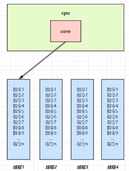
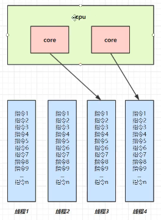

# Java并发

## 进程和线程

### 一.进程和线程的概念

```java
进程
    程序由指令和数据组成。指令需要运行，数据需要读写，就必须将指令加载至CPU，数据加载至内存，在指令的运行期间还需要用到磁盘，网络等设备。
    进程就是用来加载指令，管理内存，管理IO的。
    当一个程序被执行，从磁盘加载这个程序的代码至内存，就开启了一个进程。
    进程可以视为程序的一个实例。
    大部分程序可以同时运行多个实例进程，例如记事本，画图，浏览器等；但也有的程序只能启动一个实例进程，如网易云音乐，360安全卫士等。
```

```java
线程
    一个进程之内可以分为一个到多个线程。
    一个线程就是一个指令流，将指令流中的一条条指令一定的顺序交给CPU执行。
    Java中，线程作为最小的调度单位，进程作为资源分配的最小单位。在Windows中进程是不活动的，只是作为线程的容器。
```

### 二.进程和线程的对比

```java
1.进程基本上相互独立，而线程存在于进程内，是进程的一个子集。
    
2.进程拥有资源，如内存空间，供其内部的线程共享。
    
3.进程间通信较为复杂
    同一台计算机的进程通信，称为IPC（Inter-process-communication）
    不同计算机之间的进程通信，需要通过网络，并遵循共同的协议，例如HTTP

4.线程通信相对简单，因为他们共享进程的内存，一个例子是多个线程可以共同访问同一个共享变量。
    
5.线程更轻量，线程上下文切换成本一般要比进程上下文切换低。    
```

## 并行与并发

```java
	单核CPU下，线程实际上还是串行执行的。
	操作系统中有一个组件叫做任务调度器，将CPU的时间片（windows下时间片最小约为15ms）分给不同的线程使用，只是由于CPU在线程间（时间片很短）的切换非常快，人类感觉是同时运行的。
    一般会将这种线程轮流使用CPU的做法称为并发，concurrent。
```



```java
	多核CPU下，每个核（core）都可以调度运行线程，这时候线程可以是并行的。
```



```java
	并发是同一时间段内，应对多件事情的能力。
    并行是同一时间动手做多件事情的能力。
```

## 应用

### 一.应用之异步调用（案例一）

```java
	从方法调用的角度来讲，如果
    	需要等待结果返回，才能继续运行就是同步
    	不需要等待结果返回，就能继续运行就是异步
    注意：同步在多线程中还有另外一层意思，是让多个线程步调一致。    
```

```java
1.设计
    多线程可以让方法执行变为异步的（即不要干巴巴地等着），比如说读取磁盘文件的时候，假设读取操作花费了5秒钟，如果没有线程调度机制，这5秒调用者什么都做不了，其他代码都得暂停。
```

```java
2.结论
    比如在项目中，视频文件需要转换格式等操作比较费时，这时开一个新线程处理视频转换，避免阻塞主线程。
    
    tomcat的异步servlet也是类似的目的，让用户线程处理耗时较长的操作，避免阻塞tomcat的工作线程。
    
    UI程序中，开线程进行其他操作，避免阻塞UI线程。
```

### 二.应用之提高效率（案例二）

```java
	充分利用多核CPU的优势，提高运行效率。想象下面的场景，执行3个计算，最后将计算结果汇总。    
```

```java
	计算1花费10ms
    计算2花费11ms
    计算3花费9ms
    汇总需要1ms
```

```java
	如果是串行执行，那么总花费的时间是10 + 11 + 9 + 1 = 31ms
    但是，如果CPU是四核CPU（3核及以上），各个核心分别使用线程1执行计算1，线程2执行计算2，线程3执行计算3，那么3个线程是并行的，花费时间只取决于最长的那个线程的运行的时间，即11ms，最后加上汇总时间只会花费12ms。
        
    注意：
        需要在多核CPU才能提高效率，单核时仍然是轮流执行。
```

```java
结论
    1.单核CPU下，多线程不能实际提高程序运行效率，只是为了能够在不同的任务之间切换，不同线程轮流使用CPU，不至于一个线程总占用CPU，别的线程没法干活。
    2.多核CPU可以并行跑多个线程，但是否能够提高运行效率还是要分情况的。
    	有些任务，经过精心地设计，将任务拆分，并行执行，当然可以提高程序的运行效率，但不是所有计算任务都能拆分（阿姆达尔定律）
    	也不是所有任务都需要拆分，任务的目的如果不同，谈拆分和效率没啥意义。
    3.IO操作不占用CPU，只是我们一般拷贝文件使用的是[阻塞IO]，这是相当于线程虽然不用CPU，但需要一直等待IO结束，没能充分利用线程。所以才会有后面的[非阻塞IO]和[异步IO]的优化。
```

## Java线程

### 一.创建和运行线程

#### 1.方法一，直接使用Thread

```java
//创建线程对象
Thread t = new Thread(){
    public void run(){
        //要执行的任务
    }
};
//启动线程
t.start();
```

#### 2.方法二，使用Runnable配合Thread

```java
把[线程]和[任务]（要执行的代码）分开
    Thread代表线程
    Runable可运行的任务（线程要执行的代码）
```

```java
Runable runable = new Runable(){
    public void run(){
        //要执行的任务
    }
};
//创建线程对象
Thread t = new Thread(runable);
//启动线程
t.start();
```

```java
Java8以后可以使用lambda精简代码。
```

```java
//创建任务对象
Runable task = () -> log.debug("hello");

//参数1是任务对象；参数2是线程名字
Thread t = new Thread(task,"t");
t.start();
```

#### 原理之Thread与Runnable的关系

```java
小结：
    方法1是把线程和任务合并在了一起，方法2是把线程和任务分开了。
    
    用Runnable更容易与线程池等高级API配合。
    
    用Runnable让任务类脱离了Thread继承体系，更灵活。
```

#### 3.方法三，FutureTask配合Thread

```java
FutureTask能够接受Callable类型的参数，用来处理有返回结果的情况。
```

```java
//创建任务
FutureTask<Integer> task = new FutureTask<>(() -> {
    log.debug("hello");
    return 100;
});
//参数1是任务对象；参数2是线程名字
new Thread(task,"t").start();
//主线程阻塞，同步等待task执行完毕的结果
Integer result = task.get();
log.debug("结果是{}",result);
```

### 二.观察多个线程同时运行

```java
交替执行
谁先谁后，不由我们控制    
```


